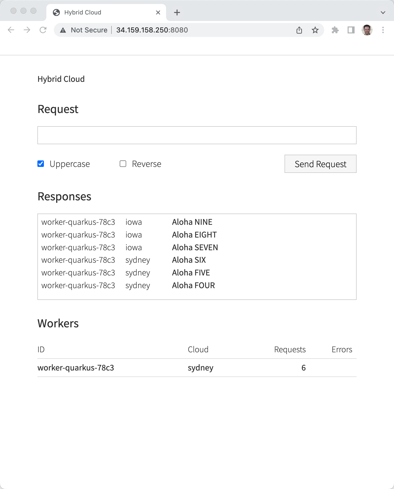

# GKE + Skupper

I am using the following Google Regions and I am not sure if this requires quota adjustment to allow for the lauching of 3 node GKE clusters

Frankfurt europe-west3 - has the frontend+backend

Sydney australia-southeast1 - backend-only

Iowa us-central1 - backend-only


```
export KUBE_EDITOR="code -w"
export PATH=~/devnation/bin:$PATH
```

```
skupper version
client version                 1.0.0
transport version              not-found
controller version             not-found
config-sync version            not-found
```

The transport, controller and config-sync versions populate after `skupper init`

```
gcloud container clusters list
```

```
# To address the following warning
# WARNING: the gcp auth plugin is deprecated in v1.22+, unavailable in v1.25+; use gcloud instead.
# To learn more, consult https://cloud.google.com/blog/products/containers-kubernetes/kubectl-auth-changes-in-gke

export PATH=/System/Volumes/Data/opt/homebrew/Caskroom/google-cloud-sdk/latest/google-cloud-sdk/bin/:$PATH
export USE_GKE_GCLOUD_AUTH_PLUGIN=True

# AND gcloud container clusters get-credentials as seen below
```

### Frankfurt Cluster Up

```
export KUBECONFIG=/Users/burr/xKS/.kubeconfig/frankfurt-config

gcloud container clusters create frankfurt --zone europe-west3 --num-nodes 1

# note: num-nodes is per zone so `kubectl get nodes` will report 3

gcloud container clusters get-credentials frankfurt --zone europe-west3
```

### Sydney Cluster Up

```
export KUBECONFIG=/Users/burr/xKS/.kubeconfig/sydney-config

gcloud container clusters create sydney --zone australia-southeast1 --num-nodes 1

gcloud container clusters get-credentials sydney --zone australia-southeast1

```

### Franfurt Skupper up

```
kubectl create namespace frankfurt
kubectl config set-context --current --namespace=frankfurt
```

```
skupper init
```

```
skupper status
Skupper is enabled for namespace "frankfurt" in interior mode. It is not connected to any other sites. It has no exposed services.
The site console url is:  https://34.141.109.254:8080
```

### Sydney Skupper up

```
kubectl create namespace sydney
kubectl config set-context --current --namespace=sydney
```

```
skupper init
```

```
skupper status
Skupper is enabled for namespace "sydney" in interior mode. It is not connected to any other sites. It has no exposed services.
The site console url is:  https://34.87.234.63:8080
```

### Frankfurt create token

```
skupper token create token.yaml -t cert
```

### Sydney link token

```
skupper link create token.yaml
```

### Frankfurt

```
skupper status
Skupper is enabled for namespace "frankfurt" in interior mode. It is connected to 1 other site. It has no exposed services.
```

### Sydney

```
Skupper is enabled for namespace "sydney" in interior mode. It is connected to 1 other site. It has no exposed services.
```

### Frankfurt Deploy App

```
kubectl apply -f backend.yml
kubectl apply -f frontend.yml
```

```
kubectl set env deployment/hybrid-cloud-backend WORKER_CLOUD_ID="frankfurt"
```

```
kubectl get services
NAME                    TYPE           CLUSTER-IP     EXTERNAL-IP      PORT(S)                           AGE
hybrid-cloud-backend    ClusterIP      10.12.8.150    <none>           8080/TCP                          2m9s
hybrid-cloud-frontend   LoadBalancer   10.12.15.201   <pending>        8080:30090/TCP                    21s
skupper                 LoadBalancer   10.12.1.136    34.141.109.254   8080:30374/TCP,8081:31533/TCP     3h44m
skupper-router          LoadBalancer   10.12.9.65     34.89.234.29     55671:32739/TCP,45671:30461/TCP   3h45m
skupper-router-local    ClusterIP      10.12.14.192   <none>           5671/TCP                          3h45m
```

```
skupper expose deployment/hybrid-cloud-backend --port 8080
```

```
FRONTENDIP=$(kubectl get service hybrid-cloud-frontend -o jsonpath="{.status.loadBalancer.ingress[0].ip}"):8080

open http://$FRONTENDIP
```


### Sydney Deploy App

```
kubectl apply -f backend.yml
```

```
kubectl get services
NAME                   TYPE           CLUSTER-IP    EXTERNAL-IP     PORT(S)                           AGE
hybrid-cloud-backend   ClusterIP      10.24.6.133   <none>          8080/TCP                          40s
skupper                LoadBalancer   10.24.5.23    34.87.234.63    8080:31305/TCP,8081:32629/TCP     21m
skupper-router         LoadBalancer   10.24.9.48    34.116.77.199   55671:31991/TCP,45671:32749/TCP   22m
skupper-router-local   ClusterIP      10.24.4.201   <none>          5671/TCP                          22m
```

```
kubectl set env deployment/hybrid-cloud-backend WORKER_CLOUD_ID="sydney"
```

Expose this service

```
skupper expose deployment/hybrid-cloud-backend --port 8080
```

```
skupper network status
Sites:
├─ [local] 49efdca - sydney
│  URL: 34.116.77.199
│  name: sydney
│  namespace: sydney
│  sites linked to: 2ead203-frankfurt
│  version: 1.0.0
│  ╰─ Services:
│     ╰─ name: hybrid-cloud-backend
│        address: hybrid-cloud-backend: 8080
│        protocol: tcp
│        ╰─ Targets:
│           ╰─ name: hybrid-cloud-backend-8cfd5874-5fww2
╰─ [remote] 2ead203 - frankfurt
   URL: 34.89.234.29
   name: frankfurt
   namespace: frankfurt
   version: 1.0.0
   ╰─ Services:
      ╰─ name: hybrid-cloud-backend
         address: hybrid-cloud-backend: 8080
         protocol: tcp
         ╰─ Targets:
            ╰─ name: hybrid-cloud-backend-557dfbd54c-99s86
```


### Frankfurt backend zero

```
kubectl scale --replicas=0 deployment/hybrid-cloud-backend
```


## Add 3rd cluster

### Iowa 
```
export KUBECONFIG=/Users/burr/xKS/.kubeconfig/iowa-config

gcloud container clusters create iowa --zone us-central1 --num-nodes 1

gcloud container clusters get-credentials iowa --zone us-central1
```

```
kubectl create namespace iowa
kubectl config set-context --current --namespace=iowa
```

```
skupper init
```

```
skupper link create token.yaml
```

```
skupper status
Skupper is enabled for namespace "iowa" in interior mode. It is connected to 2 other sites (1 indirectly). It has 1 exposed service.
```

```
kubectl apply -f backend.yml
```

```
kubectl set env deployment/hybrid-cloud-backend WORKER_CLOUD_ID="iowa"
```

```
skupper expose deployment/hybrid-cloud-backend --port 8080
```

### Sydney backend zero

```
kubectl scale --replicas=0 deployment/hybrid-cloud-backend
```




### And have some fun with it

Sydney

```
kubectl scale --replicas=1 deployment/hybrid-cloud-backend
```

Frankfurt
```
kubectl scale --replicas=1 deployment/hybrid-cloud-backend
```

To clean up the UI/Frontend just bounce the pod

Frankfurt

```
kubectl delete pod -l app.kubernetes.io/name=hybrid-cloud-frontend
``` 

```
skupper version
client version                 1.0.0
transport version              quay.io/skupper/skupper-router:2.0.1 (sha256:5f08ae90af0a)
controller version             quay.io/skupper/service-controller:1.0.0 (sha256:85f4dab48dcd)
config-sync version            quay.io/skupper/config-sync:1.0.0 (sha256:c16f8b171840)
```

```
skupper network status
Sites:
├─ [remote] 49efdca - sydney
│  URL: 34.116.77.199
│  name: sydney
│  namespace: sydney
│  sites linked to: 2ead203-frankfurt
│  version: 1.0.0
│  ╰─ Services:
│     ╰─ name: hybrid-cloud-backend
│        address: hybrid-cloud-backend: 8080
│        protocol: tcp
│        ╰─ Targets:
│           ╰─ name: hybrid-cloud-backend-8cfd5874-h92bh
├─ [local] 218e851 - iowa
│  URL: 34.136.167.87
│  name: iowa
│  namespace: iowa
│  sites linked to: 2ead203-frankfurt
│  version: 1.0.0
│  ╰─ Services:
│     ╰─ name: hybrid-cloud-backend
│        address: hybrid-cloud-backend: 8080
│        protocol: tcp
│        ╰─ Targets:
│           ╰─ name: hybrid-cloud-backend-6d78c979c8-nnndz
╰─ [remote] 2ead203 - frankfurt
   URL: 34.89.234.29
   name: frankfurt
   namespace: frankfurt
   version: 1.0.0
   ╰─ Services:
      ╰─ name: hybrid-cloud-backend
         address: hybrid-cloud-backend: 8080
         protocol: tcp
         ╰─ Targets:
            ╰─ name: hybrid-cloud-backend-557dfbd54c-k6szv
```


### Clean Up

```
gcloud container clusters delete frankfurt --zone europe-west3
gcloud container clusters delete sydney --zone australia-southeast1
gcloud container clusters delete iowa --zone us-central1
```