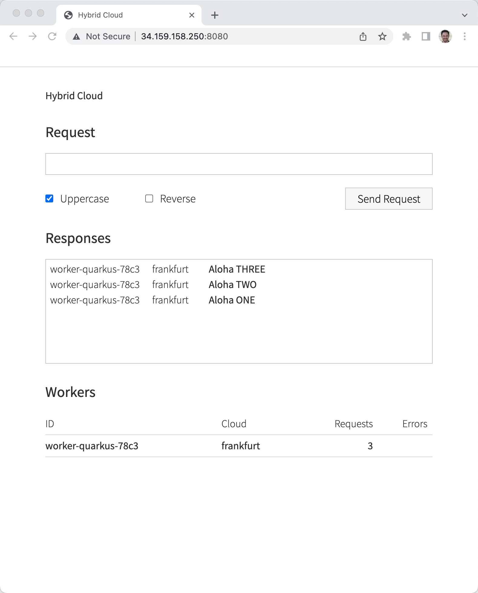
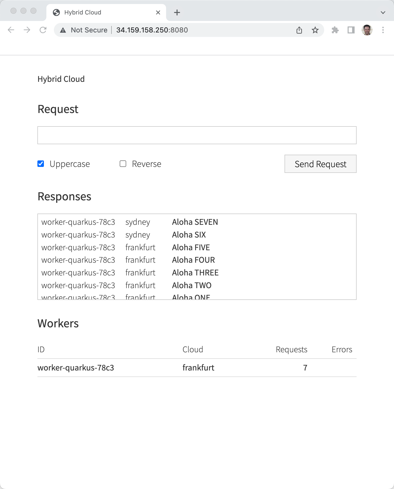
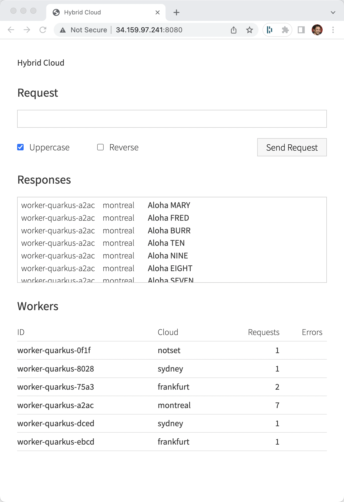
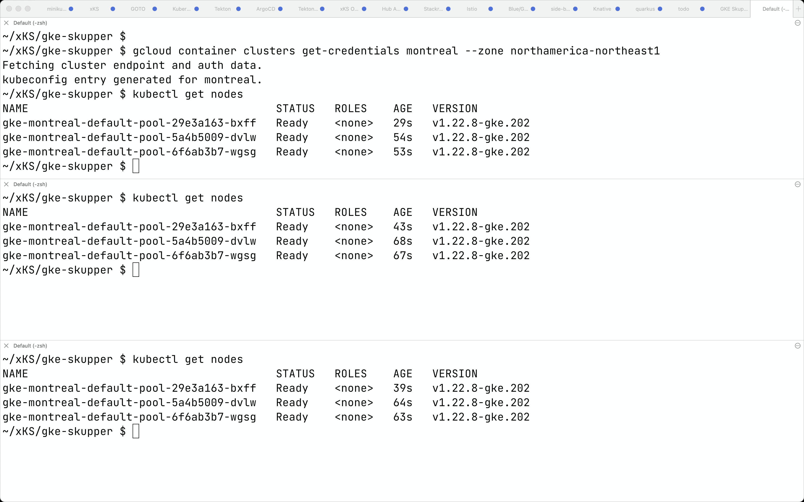
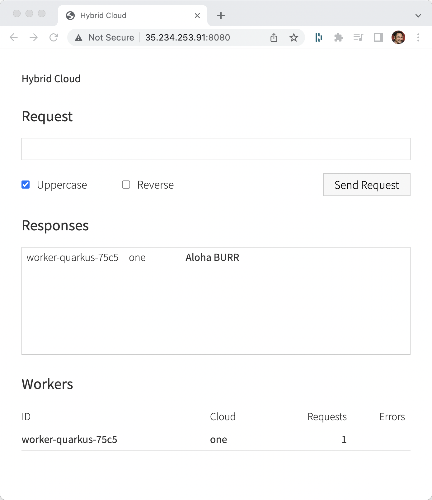
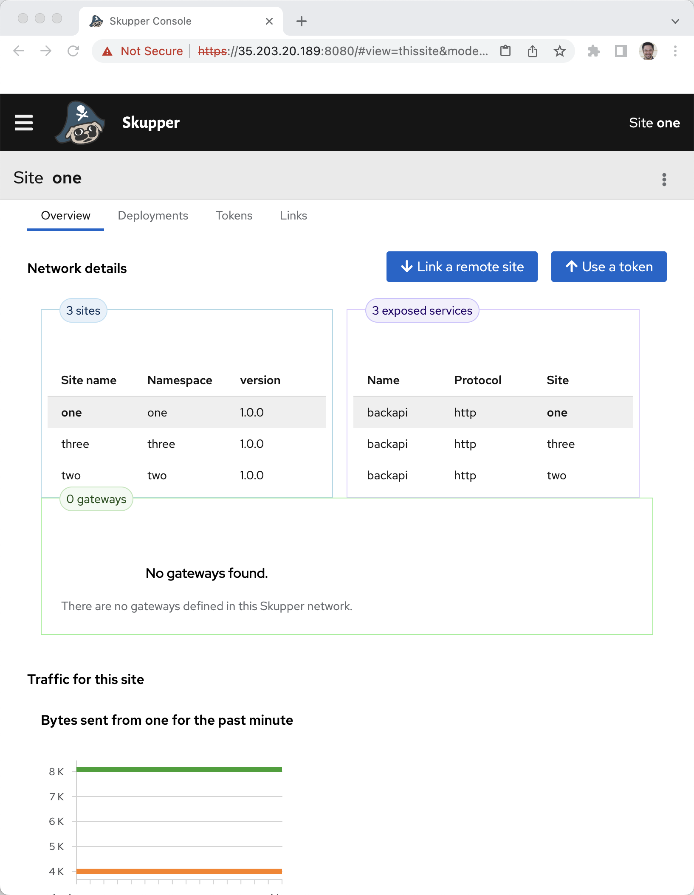
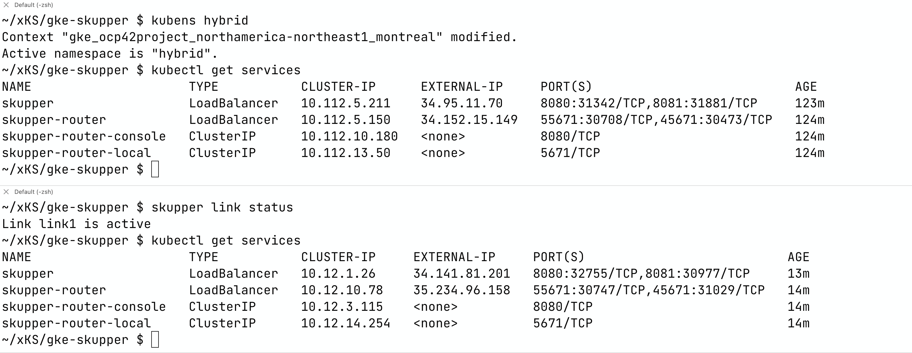
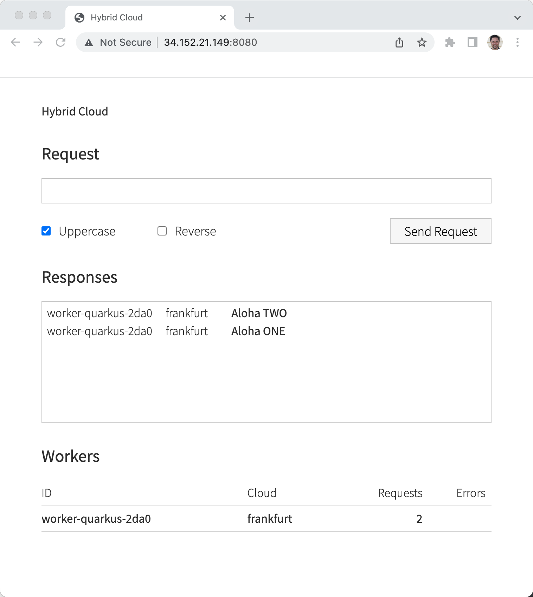

# GKE + Skupper CLI

I am using the following Google Regions and I am not sure if this requires quota adjustment to allow for the lauching of 3 node GKE clusters

Frankfurt europe-west3 - has the frontend+backend

Sydney australia-southeast1 - backend-only

Montréal northamerica-northeast1 - backend-only


```
export KUBE_EDITOR="code -w"
export PATH=~/devnation/bin:$PATH
```

## Download Skupper CLI

https://skupper.io/install/index.html


```
skupper version
client version                 1.0.0
transport version              not-found
controller version             not-found
config-sync version            not-found
```

The transport, controller and config-sync versions populate after `skupper init`

```
gcloud container clusters list
```

```
# To address the following warning
# WARNING: the gcp auth plugin is deprecated in v1.22+, unavailable in v1.25+; use gcloud instead.
# To learn more, consult https://cloud.google.com/blog/products/containers-kubernetes/kubectl-auth-changes-in-gke

export PATH=/System/Volumes/Data/opt/homebrew/Caskroom/google-cloud-sdk/latest/google-cloud-sdk/bin/:$PATH
export USE_GKE_GCLOUD_AUTH_PLUGIN=True

# AND gcloud container clusters get-credentials as seen below
```

### Frankfurt Cluster Up

```
export KUBECONFIG=/Users/burr/xKS/.kubeconfig/frankfurt-config

gcloud container clusters create frankfurt --zone europe-west3 --num-nodes 1

# note: num-nodes is per zone so `kubectl get nodes` will report 3

gcloud container clusters get-credentials frankfurt --zone europe-west3
```

### Sydney Cluster Up

```
export KUBECONFIG=/Users/burr/xKS/.kubeconfig/sydney-config

gcloud container clusters create sydney --zone australia-southeast1 --num-nodes 1

gcloud container clusters get-credentials sydney --zone australia-southeast1

```

### Franfurt Skupper up

```
kubectl create namespace frankfurt
kubectl config set-context --current --namespace=frankfurt
```

```
skupper init
```

```
skupper status
Skupper is enabled for namespace "frankfurt" in interior mode. It is not connected to any other sites. It has no exposed services.
The site console url is:  https://34.141.109.254:8080
```

### Sydney Skupper up

```
kubectl create namespace sydney
kubectl config set-context --current --namespace=sydney
```

```
skupper init
```

```
skupper status
Skupper is enabled for namespace "sydney" in interior mode. It is not connected to any other sites. It has no exposed services.
The site console url is:  https://34.87.234.63:8080
```

### Frankfurt create token

```
skupper token create token.yaml -t cert
```

### Sydney link token

```
skupper link create token.yaml
```

### Frankfurt

```
skupper status
Skupper is enabled for namespace "frankfurt" in interior mode. It is connected to 1 other site. It has no exposed services.
```

### Sydney

```
Skupper is enabled for namespace "sydney" in interior mode. It is connected to 1 other site. It has no exposed services.
```

### Frankfurt Deploy App

```
kubectl apply -f backend.yml
kubectl apply -f frontend.yml
```

```
kubectl set env deployment/backapi WORKER_CLOUD_ID="frankfurt"
```

```
kubectl get services
NAME                    TYPE           CLUSTER-IP     EXTERNAL-IP      PORT(S)                           AGE
backapi                 ClusterIP      10.12.8.150    <none>           8080/TCP                          2m9s
hybrid-cloud-frontend   LoadBalancer   10.12.15.201   <pending>        8080:30090/TCP                    21s
skupper                 LoadBalancer   10.12.1.136    34.141.109.254   8080:30374/TCP,8081:31533/TCP     3h44m
skupper-router          LoadBalancer   10.12.9.65     34.89.234.29     55671:32739/TCP,45671:30461/TCP   3h45m
skupper-router-local    ClusterIP      10.12.14.192   <none>           5671/TCP                          3h45m
```

```
skupper expose deployment/backapi --port 8080
```

```
FRONTENDIP=$(kubectl get service hybrid-cloud-frontend -o jsonpath="{.status.loadBalancer.ingress[0].ip}"):8080

open http://$FRONTENDIP
```




### Sydney Deploy App

```
kubectl apply -f backend.yml
```

```
kubectl get services
NAME                   TYPE           CLUSTER-IP    EXTERNAL-IP     PORT(S)                           AGE
backapi                ClusterIP      10.24.6.133   <none>          8080/TCP                          40s
skupper                LoadBalancer   10.24.5.23    34.87.234.63    8080:31305/TCP,8081:32629/TCP     21m
skupper-router         LoadBalancer   10.24.9.48    34.116.77.199   55671:31991/TCP,45671:32749/TCP   22m
skupper-router-local   ClusterIP      10.24.4.201   <none>          5671/TCP                          22m
```

Check on pods to verify no crashlooping

```
kubectl get pods
NAME                                          READY   STATUS    RESTARTS   AGE
backapi-6cc79dbb7c-qpvfh                      1/1     Running   0          1m45s
skupper-router-5fddbd5698-zxrjj               2/2     Running   0          24m
skupper-service-controller-69495555cd-mswhn   1/1     Running   0          24m
```

```
kubectl set env deployment/backapi WORKER_CLOUD_ID="sydney"
```

Expose this service

```
skupper expose deployment/backapi --port 8080
```

```
skupper network status
Sites:
├─ [local] 49efdca - sydney
│  URL: 34.116.77.199
│  name: sydney
│  namespace: sydney
│  sites linked to: 2ead203-frankfurt
│  version: 1.0.0
│  ╰─ Services:
│     ╰─ name: backapi
│        address: backapi: 8080
│        protocol: tcp
│        ╰─ Targets:
│           ╰─ name: backapi-8cfd5874-5fww2
╰─ [remote] 2ead203 - frankfurt
   URL: 34.89.234.29
   name: frankfurt
   namespace: frankfurt
   version: 1.0.0
   ╰─ Services:
      ╰─ name: backapi
         address: backapi: 8080
         protocol: tcp
         ╰─ Targets:
            ╰─ name: backapi-557dfbd54c-99s86
```


### Frankfurt backend zero

Start up poller

```
FRONTENDIP=$(kubectl get service hybrid-cloud-frontend -o jsonpath="{.status.loadBalancer.ingress[0].ip}"):8080

while true
do curl $FRONTENDIP/api/cloud
echo ""
sleep .3
done

```

```
kubectl scale --replicas=0 deployment/backapi
```




## Add 3rd cluster

### Montreal 
```
export KUBECONFIG=/Users/burr/xKS/.kubeconfig/montreal-config

gcloud container clusters create montreal --zone northamerica-northeast1 --num-nodes 1

gcloud container clusters get-credentials montreal --zone northamerica-northeast1
```

```
kubectl create namespace montreal
kubectl config set-context --current --namespace=montreal
```

```
skupper init
```

```
skupper link create token.yaml
```

```
skupper status
Skupper is enabled for namespace "montreal" in interior mode. It is connected to 2 other sites (1 indirectly). It has 1 exposed service.
```

```
kubectl apply -f backend.yml
```

```
kubectl set env deployment/backapi WORKER_CLOUD_ID="montreal"
```

```
skupper expose deployment/backapi --port 8080
```

### Sydney backend zero

```
kubectl scale --replicas=0 deployment/backapi
```




### And have some fun with it

Sydney

```
kubectl scale --replicas=1 deployment/backapi
```

Frankfurt
```
kubectl scale --replicas=1 deployment/backapi
```

To clean up the UI/Frontend just bounce the pod

Frankfurt

```
kubectl delete pod -l app.kubernetes.io/name=hybrid-cloud-frontend
``` 

```
skupper version
client version                 1.0.0
transport version              quay.io/skupper/skupper-router:2.0.1 (sha256:5f08ae90af0a)
controller version             quay.io/skupper/service-controller:1.0.0 (sha256:85f4dab48dcd)
config-sync version            quay.io/skupper/config-sync:1.0.0 (sha256:c16f8b171840)
```

```
skupper network status
Sites:
├─ [remote] 49efdca - sydney
│  URL: 34.116.77.199
│  name: sydney
│  namespace: sydney
│  sites linked to: 2ead203-frankfurt
│  version: 1.0.0
│  ╰─ Services:
│     ╰─ name: backapi
│        address: backapi: 8080
│        protocol: tcp
│        ╰─ Targets:
│           ╰─ name: backapi-8cfd5874-h92bh
├─ [local] 218e851 - montreal
│  URL: 34.136.167.87
│  name: montreal
│  namespace: montreal
│  sites linked to: 2ead203-frankfurt
│  version: 1.0.0
│  ╰─ Services:
│     ╰─ name: backapi
│        address: backapi: 8080
│        protocol: tcp
│        ╰─ Targets:
│           ╰─ name: backapi-6d78c979c8-nnndz
╰─ [remote] 2ead203 - frankfurt
   URL: 34.89.234.29
   name: frankfurt
   namespace: frankfurt
   version: 1.0.0
   ╰─ Services:
      ╰─ name: backapi
         address: backapi: 8080
         protocol: tcp
         ╰─ Targets:
            ╰─ name: backapi-557dfbd54c-k6szv
```


### Clean Up

```
gcloud container clusters delete sydney --zone australia-southeast1
gcloud container clusters delete frankfurt --zone europe-west3
gcloud container clusters delete montreal --zone northamerica-northeast1
```


# YAML Way

Using a single cluster and 3 namespaces of `one`, `two` and `three` to cut down on hosting costs while experimenting.

**one** holds frontend and backend

**two** and **three** backend only

### Set some env vars

```
export KUBE_EDITOR="code -w"
export PATH=~/devnation/bin:/System/Volumes/Data/opt/homebrew/Caskroom/google-cloud-sdk/latest/google-cloud-sdk/bin/:$PATH
export USE_GKE_GCLOUD_AUTH_PLUGIN=True
```

### Create a GKE Cluster

Using the same cluster for 3 Skupper Sites might need a bit more capacity, adding the auto-scaling feature of GKE

```
export KUBECONFIG=/Users/burr/xKS/.kubeconfig/montreal-config

gcloud container clusters create montreal --zone northamerica-northeast1 --num-nodes 1 --enable-autoscaling --min-nodes 1 --max-nodes 4

gcloud container clusters get-credentials montreal --zone northamerica-northeast1
```



## One

### One: Create Namespace 

```
kubectl create namespace one
kubectl config set-context --current --namespace=one
```

A secret by default

```
kubectl get secrets
NAME                  TYPE                                  DATA   AGE
default-token-6p4v7   kubernetes.io/service-account-token   3      30s
```

A configmap by default

```
kubectl get cm
NAME               DATA   AGE
kube-root-ca.crt   1      22s
```


### One: Install the application

```
kubectl apply -f backend.yml
kubectl apply -f frontend.yml
```

Wait for that pending external-ip
```
watch kubectl get services
NAME                    TYPE           CLUSTER-IP     EXTERNAL-IP   PORT(S)          AGE
backapi                 ClusterIP      10.112.7.197   <none>        8080/TCP         18s
hybrid-cloud-frontend   LoadBalancer   10.112.0.107   <pending>     8080:31470/TCP   17s
```

Responses from one's pods should include 'one'

```
kubectl set env deployment/backapi WORKER_CLOUD_ID="one"
```


### One: Install Skupper into namespace

```
kubectl -n one apply -f https://raw.githubusercontent.com/skupperproject/skupper/1.0.0/cmd/site-controller/deploy-watch-current-ns.yaml
```

#### Verify

```
kubectl get pods
NAME                                       READY   STATUS    RESTARTS   AGE
backapi-69786b84bb-kksbw                   1/1     Running   0          53m
hybrid-cloud-frontend-6d88f9cd4b-59rsp     1/1     Running   0          72m
skupper-site-controller-56d886649c-77fwc   1/1     Running   0          12s
```

```
kubectl get secrets
NAME                                  TYPE                                  DATA   AGE
default-token-6p4v7                   kubernetes.io/service-account-token   3      110s
skupper-site-controller-token-dndvc   kubernetes.io/service-account-token   3      86s
```

```
kubectl get services
NAME                    TYPE           CLUSTER-IP     EXTERNAL-IP     PORT(S)          AGE
hybrid-cloud-frontend   LoadBalancer   10.112.0.107   35.234.253.91   8080:31470/TCP   73m
```


### One: Create Site 

```
kubectl apply -f via-yaml/one.yml
```

#### Verify

```
kubectl get pods
NAME                                          READY   STATUS    RESTARTS   AGE
backapi-69786b84bb-mctx9                      1/1     Running   0          8m46s
hybrid-cloud-frontend-6d88f9cd4b-mwsk6        1/1     Running   0          8m57s
skupper-router-5769495db6-c8fsw               2/2     Running   0          5m44s
skupper-service-controller-7586497d67-ld9xb   1/1     Running   0          4m19s
skupper-site-controller-56d886649c-jk7dh      1/1     Running   0          6m23s
```

```
kubectl get cm
NAME                  DATA   AGE
kube-root-ca.crt      1      8m49s
skupper-internal      1      19s
skupper-sasl-config   1      21s
skupper-services      0      20s
skupper-site          10     21s
```

```
kubectl get secrets
NAME                                     TYPE                                  DATA   AGE
default-token-jjhtp                      kubernetes.io/service-account-token   3      9m57s
skupper-claims-server                    kubernetes.io/tls                     3      5m8s
skupper-console-certs                    kubernetes.io/tls                     3      5m8s
skupper-console-users                    Opaque                                1      6m34s
skupper-local-ca                         kubernetes.io/tls                     2      6m35s
skupper-local-client                     kubernetes.io/tls                     4      6m34s
skupper-local-server                     kubernetes.io/tls                     3      6m34s
skupper-router-token-7f957               kubernetes.io/service-account-token   3      6m35s
skupper-service-ca                       kubernetes.io/tls                     2      6m34s
skupper-service-client                   kubernetes.io/tls                     3      6m34s
skupper-service-controller-token-mj846   kubernetes.io/service-account-token   3      5m52s
skupper-site-ca                          kubernetes.io/tls                     2      6m35s
skupper-site-controller-token-glm8z      kubernetes.io/service-account-token   3      7m13s
skupper-site-server                      kubernetes.io/tls                     3      5m52s
```

```
kubectl get services
NAME                     TYPE           CLUSTER-IP      EXTERNAL-IP     PORT(S)                           AGE
hybrid-cloud-frontend    LoadBalancer   10.112.12.57    34.95.54.210    8080:31293/TCP                    10m
skupper                  LoadBalancer   10.112.1.135    35.203.20.189   8080:32404/TCP,8081:30109/TCP     6m17s
skupper-router           LoadBalancer   10.112.4.74     35.234.253.91   55671:30698/TCP,45671:32547/TCP   6m58s
skupper-router-console   ClusterIP      10.112.9.72     <none>          8080/TCP                          6m59s
skupper-router-local     ClusterIP      10.112.12.120   <none>          5671/TCP                          6m59s
```

### Test 

Expose the Deploy as a Skupper Service

```
kubectl annotate deploy backapi skupper.io/proxy=http
```

```
kubectl get services
NAME                     TYPE           CLUSTER-IP      EXTERNAL-IP     PORT(S)                           AGE
backapi                  ClusterIP      10.112.14.225   <none>          8080/TCP                          8s
hybrid-cloud-frontend    LoadBalancer   10.112.12.57    34.95.54.210    8080:31293/TCP                    12m
skupper                  LoadBalancer   10.112.1.135    35.203.20.189   8080:32404/TCP,8081:30109/TCP     8m19s
skupper-router           LoadBalancer   10.112.4.74     35.234.253.91   55671:30698/TCP,45671:32547/TCP   9m
skupper-router-console   ClusterIP      10.112.9.72     <none>          8080/TCP                          9m1s
skupper-router-local     ClusterIP      10.112.12.120   <none>          5671/TCP                          9m1s
```

Grab that Frontend IP

```
FRONTENDIP=$(kubectl get service hybrid-cloud-frontend -o jsonpath="{.status.loadBalancer.ingress[0].ip}"):8080

```

```
curl $FRONTENDIP/api/cloud
one:0
```

```
open http://$FRONTENDIP
```




### Generate Token in One

Create the token request secret in One


```
skupper status
Skupper is enabled for namespace "one" in interior mode. It is not connected to any other sites. It has 1 exposed service.
The site console url is:  https://35.203.20.189:8080
The credentials for internal console-auth mode are held in secret: 'skupper-console-users'
```

```
kubectl -n one apply -f via-yaml/request-token.yml
```

```
kubectl get secrets -l skupper.io/type=connection-token
NAME          TYPE     DATA   AGE
link-to-one   Opaque   3      38s
```

```
kubectl describe secret link-to-one
Name:         link-to-one
Namespace:    one
Labels:       skupper.io/type=connection-token
Annotations:  edge-host: 34.95.51.203
              edge-port: 45671
              inter-router-host: 34.95.51.203
              inter-router-port: 55671
              skupper.io/generated-by: 2aa764f1-5394-4ccb-a4fd-8965d341c608
              skupper.io/site-version: 1.0.0

Type:  Opaque

Data
====
ca.crt:   1119 bytes
tls.crt:  1135 bytes
tls.key:  1679 bytes
```

```
skupper network status
Sites:
╰─ [local] 72ff435 - one
   URL: 35.234.253.91
   name: one
   namespace: one
   version: 1.0.0
   ╰─ Services:
      ╰─ name: backapi
         address: backapi: 8080
         protocol: http
         ╰─ Targets:
            ╰─ name: backapi-69786b84bb-mctx9
```

```
skupper service status
Services exposed through Skupper:
╰─ backapi (http port 8080)
   ╰─ Targets:
      ╰─ app.kubernetes.io/name=backapi name=backapi
```

```
curl $FRONTENDIP/api/cloud
one:1
```


#### Prepare the token for subsequent sites

```
kubectl get secret link-to-one -o yaml > link-to-one.yaml
```

#### Modify the secret to strip out Namespace & cruft

```
brew install yq
```

```
cat link-to-one.yaml| yq 'del(.metadata.namespace)' > link-to-one-no-namespace.yaml
cat link-to-one-no-namespace.yaml| yq 'del(.metadata.resourceVersion)' > link-to-one-no-resourceVersion.yaml
cat link-to-one-no-resourceVersion.yaml| yq 'del(.metadata.uid)' > link-to-one-no-uid.yaml
```


## Two

### Two: Create Namespace 

```
kubectl create namespace two
kubectl config set-context --current --namespace=two
```


### Two: Install Skupper into namespace

```
kubectl -n two apply -f https://raw.githubusercontent.com/skupperproject/skupper/1.0.0/cmd/site-controller/deploy-watch-current-ns.yaml
```

```
kubectl get pods
NAME                                       READY   STATUS    RESTARTS   AGE
skupper-site-controller-56d886649c-kqtk5   1/1     Running   0          8m17s
```

```
kubectl get services
No resources found in two namespace.
```


### Two: Create Site 

```
kubectl apply -f via-yaml/two.yml
```

```
kubectl get pods
NAME                                          READY   STATUS    RESTARTS   AGE
skupper-router-64dffcb645-td9xl               2/2     Running   0          117s
skupper-service-controller-686dd6d996-pp4n4   1/1     Running   0          34s
skupper-site-controller-56d886649c-kqtk5      1/1     Running   0          10m
```

Note: if the skupper-service-controller fails to appear, it is possible you have a timeout in skupper-site-controller. 
`kubectl logs skupper-site-controller-56d886649c-kqtk5` 

Workaround is to delete namespace two and start over

```
kubectl get services
NAME                     TYPE           CLUSTER-IP      EXTERNAL-IP     PORT(S)                           AGE
skupper                  LoadBalancer   10.112.1.11     34.152.48.197   8080:30752/TCP,8081:32529/TCP     100s
skupper-router           LoadBalancer   10.112.1.28     35.203.25.105   55671:30840/TCP,45671:32507/TCP   2m20s
skupper-router-console   ClusterIP      10.112.14.20    <none>          8080/TCP                          2m20s
skupper-router-local     ClusterIP      10.112.11.252   <none>          5671/TCP                          2m20s
```

```
skupper status
Skupper is enabled for namespace "two" in interior mode. It is not connected to any other sites. It has no exposed services.
The site console url is:  https://34.152.48.197:8080
The credentials for internal console-auth mode are held in secret: 'skupper-console-users'
```

#### Link with Token

```
kubectl config set-context --current --namespace=two
kubectl apply -f link-to-one-no-uid.yaml
```

```
skupper status
Skupper is enabled for namespace "two" in interior mode. It is connected to 1 other site. It has 1 exposed service.
The site console url is:  https://34.152.48.197:8080
The credentials for internal console-auth mode are held in secret: 'skupper-console-users'
```

```
skupper network status
Sites:
├─ [local] b6facf1 - two
│  URL: 35.203.25.105
│  name: two
│  namespace: two
│  sites linked to: 72ff435-one
│  version: 1.0.0
│  ╰─ Services:
│     ╰─ name: backapi
│        address: backapi: 8080
│        protocol: http
╰─ [remote] 72ff435 - one
   URL: 35.234.253.91
   name: one
   namespace: one
   version: 1.0.0
   ╰─ Services:
      ╰─ name: backapi
         address: backapi: 8080
         protocol: http
         ╰─ Targets:
            ╰─ name: backapi-69786b84bb-45kqs
```


### Two: Backend

```
kubectl config set-context --current --namespace=two
```

```
kubectl apply -f backend.yml
kubectl set env deployment/backapi WORKER_CLOUD_ID="two"
```

Expose the backapi from Two

```
kubectl annotate deployment backapi skupper.io/proxy=http
```

```
skupper service status
Services exposed through Skupper:
╰─ backapi (http port 8080)
   ╰─ Targets:
      ╰─ app.kubernetes.io/name=backapi name=backapi
```

```
skupper status
Skupper is enabled for namespace "two" in interior mode. It is connected to 1 other site. It has 1 exposed service.
The site console url is:  https://34.152.48.197:8080
The credentials for internal console-auth mode are held in secret: 'skupper-console-users'
```

After exposing Two's backapi to One then turn off One

### Fail-over from One to Two

```
kubectl -n one scale --replicas=0 deployment/backapi
```

```
curl $FRONTENDIP/api/cloud
two:0
```

### Three

```
kubectl create namespace three
kubectl config set-context --current --namespace=three
```

```
kubectl apply -f https://raw.githubusercontent.com/skupperproject/skupper/1.0.0/cmd/site-controller/deploy-watch-current-ns.yaml
```

```
kubectl apply -f via-yaml/three.yml
```

```
kubectl apply -f backend.yml
```

```
kubectl set env deployment/backapi WORKER_CLOUD_ID="three"
```

Expose backapi 

```
kubectl annotate deployment backapi skupper.io/proxy=http
```

and Link it to One

```
kubectl apply -f link-to-one-no-uid.yaml
```

```
skupper status
Skupper is enabled for namespace "three" in interior mode. It is connected to 2 other sites (1 indirectly). It has 1 exposed service.
The site console url is:  https://34.95.24.191:8080
The credentials for internal console-auth mode are held in secret: 'skupper-console-users'
```

```
skupper service status
Services exposed through Skupper:
╰─ backapi (http port 8080)
   ╰─ Targets:
      ╰─ app.kubernetes.io/name=backapi name=backapi
```


```
skupper network status
Sites:
├─ [local] 66d3222 - three
│  URL: 34.152.9.114
│  name: three
│  namespace: three
│  sites linked to: 72ff435-one
│  version: 1.0.0
│  ╰─ Services:
│     ╰─ name: backapi
│        address: backapi: 8080
│        protocol: http
│        ╰─ Targets:
│           ╰─ name: backapi-65959d4f94-2svx5
├─ [remote] 72ff435 - one
│  URL: 35.234.253.91
│  name: one
│  namespace: one
│  version: 1.0.0
│  ╰─ Services:
│     ╰─ name: backapi
│        address: backapi: 8080
│        protocol: http
╰─ [remote] b6facf1 - two
   URL: 35.203.25.105
   name: two
   namespace: two
   sites linked to: 72ff435-one
   version: 1.0.0
   ╰─ Services:
      ╰─ name: backapi
         address: backapi: 8080
         protocol: http
```


```
kubectl -n one scale --replicas=0 deployment/backapi
kubectl -n two scale --replicas=0 deployment/backapi
```

```
curl $FRONTENDIP/api/cloud
```

### Costs


See the current costs

```
kubectl exec deploy/skupper-router -c router -- skmanage query --type node | jq -r '.[] | "Name: \(.name) - Cost: \(if .cost |.==null then 0 else .cost end)"'
```


### Console

Display the password

```
skupper status
Skupper is enabled for namespace "one" in interior mode. It is connected to 2 other sites. It has 1 exposed service.
The site console url is:  https://34.95.24.191:8080
The credentials for internal console-auth mode are held in secret: 'skupper-console-users'
```

```
kubectl get secret skupper-console-users -o jsonpath='{.data.admin}' | base64 -d
```

```
open https://34.95.24.191:8080
```

and `admin` + `mypassword`





### Clean Up

You can simply delete the namepaces of `one`, `two` and `three` or wipe out the whole cluster

```
gcloud container clusters delete montreal --zone northamerica-northeast1
```

## ArgoCD Way

```
export KUBECONFIG=/Users/burr/xKS/.kubeconfig/montreal-config

gcloud container clusters create montreal --zone northamerica-northeast1 --num-nodes 1 --enable-autoscaling --min-nodes 1 --max-nodes 4

```

```
gcloud container clusters get-credentials montreal --zone northamerica-northeast1
```

```
kubectl create namespace argocd
kubectl apply -n argocd -f https://raw.githubusercontent.com/argoproj/argo-cd/stable/manifests/core-install.yaml
```

```
argocd login --core
kubectl config set-context --current --namespace=argocd


argocd app list
NAME  CLUSTER  NAMESPACE  PROJECT  STATUS  HEALTH  SYNCPOLICY  CONDITIONS  REPO  PATH  TARGET
```

```
kubectl get pods
NAME                                                READY   STATUS    RESTARTS   AGE
argocd-application-controller-0                     1/1     Running   0          7m17s
argocd-applicationset-controller-6948b57c5f-dsd78   1/1     Running   0          7m18s
argocd-redis-55d64cd8bf-l7h44                       1/1     Running   0          7m18s
argocd-repo-server-559795ff4-kqdp9                  1/1     Running   0          7m18s
```

```
kubectl apply -f https://raw.githubusercontent.com/burrsutter/gke-skupper/main/argocd-skupper/application-skupper-montreal.yaml
```

```
kubectl get applications
NAME      SYNC STATUS   HEALTH STATUS
skupper   OutOfSync     Missing
```

```
argocd app list
NAME     CLUSTER                         NAMESPACE  PROJECT  STATUS     HEALTH   SYNCPOLICY  CONDITIONS  REPO                                           PATH                              TARGET
skupper  https://kubernetes.default.svc  hybrid     default  OutOfSync  Missing  <none>      <none>      https://github.com/burrsutter/gke-skupper.git  argocd-skupper/overlays/montreal  HEAD
```

```
argocd app sync skupper
```

```
kubectl get namespaces
NAME              STATUS   AGE
argocd            Active   82m
default           Active   87m
hybrid            Active   7s
kube-node-lease   Active   88m
kube-public       Active   88m
kube-system       Active   88m
```

```
kubectl get pods -n hybrid
NAME                                          READY   STATUS    RESTARTS   AGE
skupper-router-6c884f6448-8x52v               2/2     Running   0          4m12s
skupper-service-controller-7c79f5f947-6lgtj   1/1     Running   0          2m51s
skupper-site-controller-56d886649c-rwjpv      1/1     Running   0          4m16s
```

```
skupper -n hybrid status
Skupper is enabled for namespace "hybrid" with site name "montreal" in interior mode. It is not connected to any other sites. It has no exposed services.
The site console url is:  https://34.95.11.70:8080
The credentials for internal console-auth mode are held in secret: 'skupper-console-users'
```

Repeat for Frankfurt

```
export KUBECONFIG=/Users/burr/xKS/.kubeconfig/frankfurt-config

gcloud container clusters create frankfurt --zone europe-west3 --num-nodes 1 --enable-autoscaling --min-nodes 1 --max-nodes 4
```

```
gcloud container clusters get-credentials frankfurt --zone europe-west3
```

Repeat the ArgoCD installation steps above

```
kubectl apply -f https://raw.githubusercontent.com/burrsutter/gke-skupper/main/argocd-skupper/application-skupper-frankfurt.yaml

argocd app sync skupper
```

I am currently unaware of how to perform the Skupper token extraction and insertion via ArgoCD, so just going back to the CLI solution

### Montreal

```
skupper -n hybrid token create token.yaml -t cert
```

### Frankfurt

```
skupper -n hybrid link create token.yaml
```

```
skupper link status
```



### Montreal

Deploy frontend and backend via ArgoCD

```
kubectl -n argocd apply -f https://raw.githubusercontent.com/burrsutter/gke-skupper/main/argocd-frontend/application-frontend.yml
```

```
kubens argocd
argocd app list
NAME      CLUSTER                         NAMESPACE  PROJECT  STATUS     HEALTH   SYNCPOLICY  CONDITIONS  REPO                                           PATH                              TARGET
frontend  https://kubernetes.default.svc  hybrid     default  OutOfSync  Missing  <none>      <none>      https://github.com/burrsutter/gke-skupper.git  argocd-frontend/base              HEAD
skupper   https://kubernetes.default.svc  hybrid     default  Synced     Healthy  <none>      <none>      https://github.com/burrsutter/gke-skupper.git  argocd-skupper/overlays/montreal  HEAD
```

```
argocd app sync frontend
```

```
kubectl get pods -n hybrid
NAME                                          READY   STATUS    RESTARTS   AGE
hybrid-cloud-frontend-6d88f9cd4b-xkc74        1/1     Running   0          19s
skupper-router-6c884f6448-8x52v               2/2     Running   0          176m
skupper-service-controller-7c79f5f947-6lgtj   1/1     Running   0          175m
skupper-site-controller-56d886649c-rwjpv      1/1     Running   0          176m
```


#### dry run

```
cd argocd-backend
kubectl apply -k overlays/frankfurt/ --dry-run=client -o yaml
```

Add the backend to Montreal

```
kubectl -n argocd apply -f https://raw.githubusercontent.com/burrsutter/gke-skupper/main/argocd-backend/application-backend-montreal.yaml
```

```
argocd app list
NAME      CLUSTER                         NAMESPACE  PROJECT  STATUS     HEALTH   SYNCPOLICY  CONDITIONS  REPO                                           PATH                              TARGET
backend   https://kubernetes.default.svc  hybrid     default  OutOfSync  Missing  <none>      <none>      https://github.com/burrsutter/gke-skupper.git  argocd-backend/overlays/montreal  HEAD
frontend  https://kubernetes.default.svc  hybrid     default  Synced     Healthy  <none>      <none>      https://github.com/burrsutter/gke-skupper.git  argocd-frontend/base              HEAD
skupper   https://kubernetes.default.svc  hybrid     default  Synced     Healthy  <none>      <none>      https://github.com/burrsutter/gke-skupper.git  argocd-skupper/overlays/montreal  HEAD
```

```
argocd app sync backend
```

```
kubectl get pods -n hybrid
NAME                                          READY   STATUS    RESTARTS   AGE
backapi-6c986dcbd-7dkzw                       1/1     Running   0          23s
hybrid-cloud-frontend-6d88f9cd4b-xkc74        1/1     Running   0          93m
skupper-router-6c884f6448-8x52v               2/2     Running   0          4h29m
skupper-service-controller-7c79f5f947-6lgtj   1/1     Running   0          4h28m
skupper-site-controller-56d886649c-rwjpv      1/1     Running   0          4h29m
```

```
skupper status
Skupper is enabled for namespace "hybrid" with site name "montreal" in interior mode. It is connected to 1 other site. It has 1 exposed service.
The site console url is:  https://34.95.11.70:8080
The credentials for internal console-auth mode are held in secret: 'skupper-console-users'
```

The backapi service magically appears due to the annotation on the Deployment that tells it to be Skupper'ized

```
kubectl get services -n hybrid
NAME                     TYPE           CLUSTER-IP      EXTERNAL-IP     PORT(S)                           AGE
backapi                  ClusterIP      10.112.14.0     <none>          8080/TCP                          61s
hybrid-cloud-frontend    LoadBalancer   10.112.2.69     34.152.21.149   8080:31823/TCP                    102m
skupper                  LoadBalancer   10.112.5.211    34.95.11.70     8080:31342/TCP,8081:31881/TCP     4h37m
skupper-router           LoadBalancer   10.112.5.150    34.152.15.149   55671:30708/TCP,45671:30473/TCP   4h38m
skupper-router-console   ClusterIP      10.112.10.180   <none>          8080/TCP                          4h38m
skupper-router-local     ClusterIP      10.112.13.50    <none>          5671/TCP                          4h38m
```

```
FRONTENDIP=$(kubectl get service hybrid-cloud-frontend -o jsonpath="{.status.loadBalancer.ingress[0].ip}"):8080

curl $FRONTENDIP/api/cloud
montreal:0%
```


### Frankfurt Backend

```
kubens argocd

kubectl apply -f https://raw.githubusercontent.com/burrsutter/gke-skupper/main/argocd-backend/application-backend-frankfurt.yaml
```

```
argocd app list
```

```
kubectl get pods -n hybrid
NAME                                         READY   STATUS    RESTARTS   AGE
backapi-6f54c5f7bc-766c6                     1/1     Running   0          27s
skupper-router-689cb446b7-j9hxd              2/2     Running   0          173m
skupper-service-controller-b7d6df6fb-nfmsc   1/1     Running   0          172m
skupper-site-controller-56d886649c-67zqc     1/1     Running   0          173m
```

Fail-over from Montreal to Frankfurt

### Montreal

```
kubectl -n hybrid scale --replicas=0 deployment/backapi
```

```
curl $FRONTENDIP/api/cloud
frankfurt:0%
```

```
open http://$FRONTENDIP
```




### Add Sydney

```
export KUBECONFIG=/Users/burr/xKS/.kubeconfig/sydney-config

gcloud container clusters create sydney --zone australia-southeast1 --num-nodes 1 --enable-autoscaling --min-nodes 1 --max-nodes 4
```

```
gcloud container clusters get-credentials sydney --zone australia-southeast1
```

```
kubectl create namespace argocd
kubectl apply -n argocd -f https://raw.githubusercontent.com/argoproj/argo-cd/stable/manifests/core-install.yaml
```

```
argocd login --core
kubectl config set-context --current --namespace=argocd


argocd app list
NAME  CLUSTER  NAMESPACE  PROJECT  STATUS  HEALTH  SYNCPOLICY  CONDITIONS  REPO  PATH  TARGET
```

```
kubectl get pods
NAME                                                READY   STATUS    RESTARTS   AGE
argocd-application-controller-0                     1/1     Running   0          7m17s
argocd-applicationset-controller-6948b57c5f-dsd78   1/1     Running   0          7m18s
argocd-redis-55d64cd8bf-l7h44                       1/1     Running   0          7m18s
argocd-repo-server-559795ff4-kqdp9                  1/1     Running   0          7m18s
```

```
kubectl apply -f https://raw.githubusercontent.com/burrsutter/gke-skupper/main/argocd-skupper/application-skupper-sydney.yaml
```

```
kubectl get applications
NAME      SYNC STATUS   HEALTH STATUS
skupper   OutOfSync     Missing
```

```
argocd app list
NAME     CLUSTER                         NAMESPACE  PROJECT  STATUS     HEALTH   SYNCPOLICY  CONDITIONS  REPO                                           PATH                              TARGET
skupper  https://kubernetes.default.svc  hybrid     default  OutOfSync  Missing  <none>      <none>      https://github.com/burrsutter/gke-skupper.git  argocd-skupper/overlays/montreal  HEAD
```

```
argocd app sync skupper
```

```
kubectl get namespaces
NAME              STATUS   AGE
argocd            Active   82m
default           Active   87m
hybrid            Active   7s
kube-node-lease   Active   88m
kube-public       Active   88m
kube-system       Active   88m
```

```
kubectl get pods -n hybrid
NAME                                          READY   STATUS    RESTARTS   AGE
skupper-router-6c884f6448-8x52v               2/2     Running   0          4m12s
skupper-service-controller-7c79f5f947-6lgtj   1/1     Running   0          2m51s
skupper-site-controller-56d886649c-rwjpv      1/1     Running   0          4m16s
```

```
skupper -n hybrid status
Skupper is enabled for namespace "hybrid" with site name "montreal" in interior mode. It is not connected to any other sites. It has no exposed services.
The site console url is:  https://34.95.11.70:8080
The credentials for internal console-auth mode are held in secret: 'skupper-console-users'
```

```
skupper -n hybrid link create token.yaml
```

```
skupper -n hybrid link status
Link link1 is active
```

```
kubectl -n argocd apply -f https://raw.githubusercontent.com/burrsutter/gke-skupper/main/argocd-backend/application-backend-sydney.yaml
```

```
argocd app sync backend
```

```
kubectl get services -n hybrid
```


### Frankfurt
```
kubectl -n hybrid scale --replicas=0 deployment/backapi
```


```
curl $FRONTENDIP/api/cloud
sydney:0%
```


### Clean Up

```
gcloud container clusters delete sydney --zone australia-southeast1
gcloud container clusters delete frankfurt --zone europe-west3
gcloud container clusters delete montreal --zone northamerica-northeast1
```